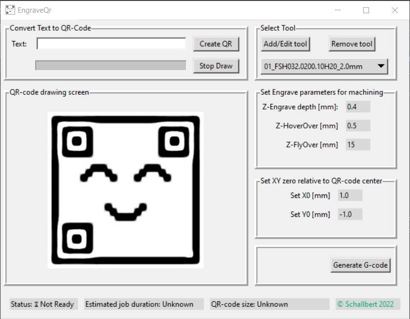

# QR-codengrave

This is a small python application that takes a string, converts
it into a QR-code (with help of @nayuki 's excellent QR-code generator)
and then allows to create CNC toolpaths that enables efficient and quick engraving.

The project is written in Python. The program is not very fast or creates super elegant tool paths,
but special care has to be taken to get the machining time as low as possible.

## Disclaimer
This application outputs instruction for real-world machinery that does actually do things in the physical world.
Although I created this software with all due care, I cannot take any responsibility for how and for what this software
is used. Of course there might be bugs that potentially crashes your machine or worse. It is your liability to carefully
check the outputs of this software and to make sure that it does not cause any harm.

## Usage

### Install
I'm planning on providing a pyinstaller single-file application via Github Actions. This can simple be downloaded and executed.

### QR-Code
Once running, just enter the text for the QR-code you want to have engraved. Press `Create Qr`. For drawing I used the (slow)
turtle provided with tkinter, so you can optionally skip this by pressing `Stop Draw`. 

### Tool selection
Then add or select the tool
you want to use for engraving. The QR-code's workpiece size directly depends on tool tip diameter. The tool list is
persisted so no data is lost on application restart.

### Engrave parameters
Click the parameter values to change. You can adjust
- flyover height (moving to workpiece XY-0)
- hover height (in-job moves between bit pixels)
- engrave depth
which will be reflected in the G-code.

### Set XY-0
Click the parameter values to change. You can select between an edge/center of the QR-code as XY-0 or enter a custom 
value, e.g. relevant if the qr-code is to be placed somewhere on a larger workpiece

### Generate G-Code
This will run a `StringIO` generator that creates a file object containing the instructions for a milling machine 
to engrave your QR-code. Currently, it is optimized for my machine type and uses no postprocessor (I'm not familiar 
with other machines and their control software, so you might have to adjust the generator for your machine.)

## Code modules
The application consists of three modules:
- vectorize_qr
- gui
- cam

### vectorize_qr
Contains all classes and helper functions to create a QR-code and convert it into vectors of "black" and "white" fields.
It also defines the machining strategy by selecting the toolpath.
Current implementation only supports inwards-spiral paths.

### gui
The interface of the application to the user. Offers fields to enter the string to convert to QR-code, manages tools for the CAM module,
and displays toolpaths and QR parameters (size, dimensions, etc). Also enables the user to select engrave depth parameters and to set 
the workpiece's XY zero offset.

### machinify_vector
Class that is able to generate G-code instructions for a Computerized Numerical Control milling machine from QR-code bitfield vectors
from `vectorize_qr` with help of parameters entered through the `gui` module.

## Testing
The application features unit tests for the developed algorithms. It spares out the `gui` though which has been tested
manually only.

## Credits
- to my wife who always has my back.
- @likosdev who gifted the lovely QRUWU logo.